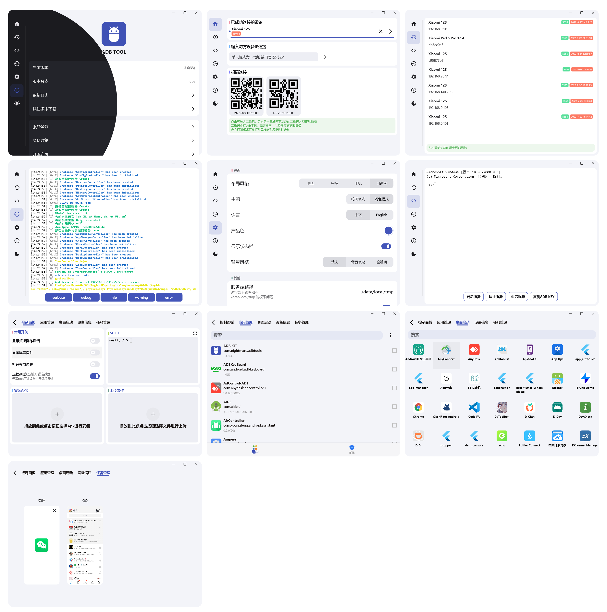

# ADB工具

 
[](https://github.com/nightmare-space/adb_tool/commits/master)
[](https://github.com/nightmare-space/adb_tool/pulls)
[](https://github.com/nightmare-space/adb_tool)
[](https://github.com/nightmare-space/adb_tool/blob/master/LICENSE)
      [](https://app.codacy.com/gh/nightmare-space/adb_tool?utm_source=github.com&utm_medium=referral&utm_content=nightmare-space/adb_tool&utm_campaign=Badge_Grade)
 
这是一个基于 ADB 的 ADB 客户端工具，支持 Windows、macOS、Linux 与 Android，能够更方便的使用 adb 命令行的功能，也能使用 adb 命令行不能直接使用的功能，例如应用管理、桌面启动器。

ADB Toolbox 可用来提高安卓开发者的开发效率，或为极客型用户提供更强大的功能。

为安卓设备也能提供快速的本地运行 ADB 的方案，我们可以快速的通过这个客户端实现 Android OTG Android 并使用 adb 的功能。

adb 这个简单的可执行文件其实远比我们想象中的强大，adb shell命令在android设备上能获取的权限也非常高，一些需要动态申请的权限adb shell都能直接获取到。
但 adb 始终作为命令行工具，我们无法快捷的使用各部分功能，这也是这个 ADB 客户端工具存在的意义之一。

## 注意！！！

这个仓库仍在大量开发维护中，但是由于平时工作缘故，所以不会有太多空闲的时间，相关的截图等都没来得及更新，见谅！！！

**编译不过请联系 github 上的邮箱或者qq**

## 下载
- [个人服务器地址](http://nightmare.fun/YanTool/resources/ADBTool/?C=N;O=A)

## 截图




## 功能列表
- 可扩展
- 快捷管理多设备调试
- 扫码、局域网发现等快速连接设备
- 快捷上传，安装应用
- 为设备免 Root 开启 ADB
- 安卓免root连接另一台安卓
- 将 ADB 安装到系统
- 历史记录
- 应用管理器，桌面启动器
- 快捷启动
   - scene
   - 黑域
   - 冰箱
   - shizuku

## BSD

```
BSD 3-Clause License

Copyright (c) 2021,  Nightmare
All rights reserved.

Redistribution and use in source and binary forms, with or without
modification, are permitted provided that the following conditions are met:

1. Redistributions of source code must retain the above copyright notice, this
   list of conditions and the following disclaimer.

2. Redistributions in binary form must reproduce the above copyright notice,
   this list of conditions and the following disclaimer in the documentation
   and/or other materials provided with the distribution.

3. Neither the name of the copyright holder nor the names of its
   contributors may be used to endorse or promote products derived from
   this software without specific prior written permission.

THIS SOFTWARE IS PROVIDED BY THE COPYRIGHT HOLDERS AND CONTRIBUTORS "AS IS"
AND ANY EXPRESS OR IMPLIED WARRANTIES, INCLUDING, BUT NOT LIMITED TO, THE
IMPLIED WARRANTIES OF MERCHANTABILITY AND FITNESS FOR A PARTICULAR PURPOSE ARE
DISCLAIMED. IN NO EVENT SHALL THE COPYRIGHT HOLDER OR CONTRIBUTORS BE LIABLE
FOR ANY DIRECT, INDIRECT, INCIDENTAL, SPECIAL, EXEMPLARY, OR CONSEQUENTIAL
DAMAGES (INCLUDING, BUT NOT LIMITED TO, PROCUREMENT OF SUBSTITUTE GOODS OR
SERVICES; LOSS OF USE, DATA, OR PROFITS; OR BUSINESS INTERRUPTION) HOWEVER
CAUSED AND ON ANY THEORY OF LIABILITY, WHETHER IN CONTRACT, STRICT LIABILITY,
OR TORT (INCLUDING NEGLIGENCE OR OTHERWISE) ARISING IN ANY WAY OUT OF THE USE
OF THIS SOFTWARE, EVEN IF ADVISED OF THE POSSIBILITY OF SUCH DAMAGE.

```